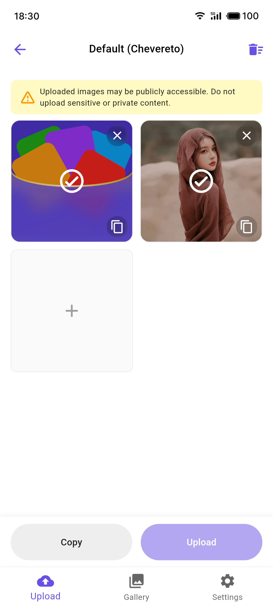
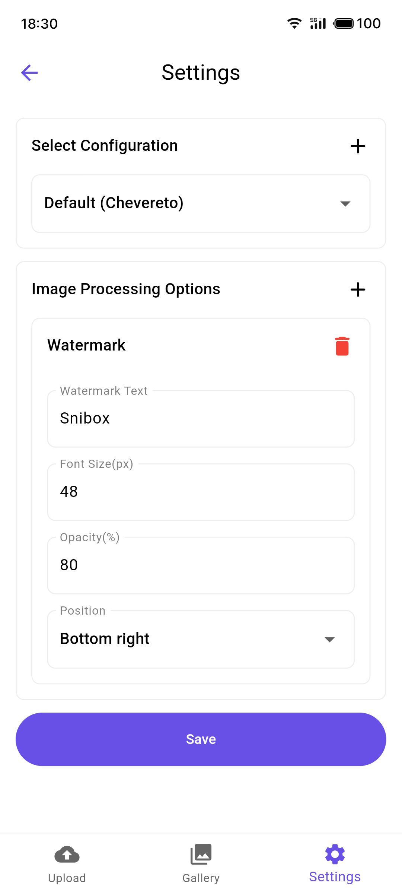

<h4 align="right"><strong><a href="README.md">English</a></strong> | 中文</h4>

<div align="center">
    <h2>📢 推荐应用</h2>
    <p>Snipic 是 Snibox 全能工具箱中的一个子功能。欢迎下载 Snibox 体验更多实用工具</p>

<div align="center">
    
    <h1 style="border-bottom: none;">Snibox</h1>
</div>
    <a href="https://apps.apple.com/app/snibox/id">
        
    </a>
</div>

# Snipic

Snipic 是一个功能丰富、支持多种云存储提供商的图床应用。

### 截图

<table>
  <tr>
    <td></td>
    <td></td>
  </tr>
</table>

## 功能特性

- **多种存储提供商**: 支持多种图床服务，包括：
  - SM.MS
  - Imgur
  - 七牛云
  - Chevereto
  - 腾讯云 COS
  - 阿里云 OSS
  - 又拍云
- **强大的图片处理**: 
  - 上传前图片处理：在上传之前，您可以对图片进行多种操作
    - 调整大小：轻松缩放图片尺寸
    - 压缩：减小文件大小，节省存储空间
    - 添加水印：为图片添加自定义水印，保护版权
  - 批量处理：同时对多张图片应用相同的处理操作
- **图库视图**: 浏览和管理已上传的图片
- **自定义配置**: 轻松切换不同的存储提供商
- **批量上传**: 一次上传多张图片
- **复制链接**: 快速复制图片URL以便分享

## 开始使用

### 前置要求

- Flutter SDK
- Dart SDK

### 安装

1. 克隆仓库：
   ```
   git clone https://github.com/aidevjoe/snipic.git
   ```
2. 进入项目目录：
   ```
   cd snipic
   ```
3. 安装依赖：
   ```
   flutter pub get
   ```

## 使用说明

1. 在设置页面配置您的存储提供商。
2. 在设置页面创建和保存您的图片处理流程（可选）。
3. 使用上传页面选择图片。
4. 在上传之前，应用您想要的图片处理操作：
   - 选择预设的处理流程或单独应用处理操作
   - 预览处理后的图片效果
   - 根据需要调整处理参数
5. 上传处理后的图片。
6. 在图库页面查看和管理您上传的图片。

## 贡献

欢迎贡献！请随时提交 Pull Request。

1. Fork 项目
2. 创建您的特性分支 (`git checkout -b feature/AmazingFeature`)
3. 提交您的改动 (`git commit -m '添加一些新特性'`)
4. 将您的修改记录提交到远程 git 仓库 (`git push origin feature/AmazingFeature`)
5. 然后到 GitHub 网站的该 `git` 远程仓库的 `feature/AmazingFeature` 分支下发起 Pull Request

## 许可证

该项目使用 MIT 许可证 - 查看 [LICENSE](LICENSE) 文件了解详情。