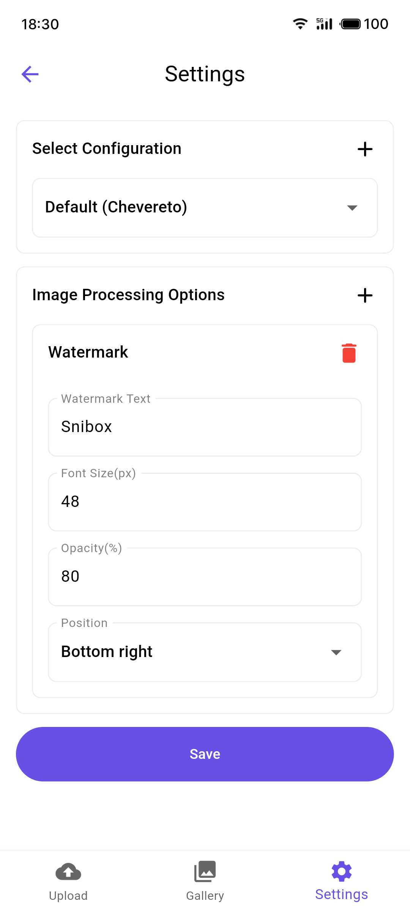

<h4 align="right">English | <strong><a href="README_CN.md">中文</a></strong></h4>

<div align="center">
    <h2>📢 Recommended App</h2>
    <p>This Snipic is just one feature of the Snibox all-in-one toolbox.</p>
    <p>Want to experience more useful tools? Download Snibox for a comprehensive productivity boost!</p>
    <div align="center">
    
    <h1 style="border-bottom: none;">Snibox</h1>
   </div>
    <a href="https://apps.apple.com/en/app/id6572311811">
        
    </a>
</div>

# Snipic

Snipic is a versatile and powerful image hosting application that supports multiple cloud storage providers and offers various image processing capabilities.

## Screenshots

<table>
  <tr>
    <td></td>
    <td></td>
  </tr>
</table>

## Features

- **Multiple Storage Providers**: Support for various image hosting services including:
  - SM.MS
  - Imgur
  - Qiniu
  - Chevereto
  - Tencent COS
  - Aliyun OSS
  - Upyun
- **Powerful Image Processing**: 
  - Pre-upload image processing: Perform various operations on images before uploading
    - Resize: Easily scale image dimensions
    - Compress: Reduce file size to save storage space
    - Watermark: Add custom watermarks to protect your images
  - Batch processing: Apply the same processing operations to multiple images at once
- **Gallery View**: Browse and manage your uploaded images
- **Customizable Configurations**: Easily switch between different storage providers
- **Batch Upload**: Upload multiple images at once
- **Copy URL**: Quickly copy image URLs for sharing

## Getting Started

### Prerequisites

- Flutter SDK
- Dart SDK

### Installation

1. Clone the repository:
   ```
   git clone https://github.com/aidevjoe/snipic.git
   ```
2. Navigate to the project directory:
   ```
   cd snipic
   ```
3. Install dependencies:
   ```
   flutter pub get
   ```

## Usage

1. Configure your storage provider(s) in the settings page.
2. Create and save your image processing workflows in the settings page (optional).
3. Use the upload page to select images.
4. Before uploading, apply desired image processing operations:
   - Choose a preset workflow or apply individual processing operations
   - Preview the processed image effects
   - Adjust processing parameters as needed
5. Upload the processed images.
6. View and manage your uploaded images in the gallery page.

## Contributing

Contributions are welcome! Please feel free to submit a Pull Request.

1. Fork the project
2. Create your feature branch (`git checkout -b feature/AmazingFeature`)
3. Commit your changes (`git commit -m 'Add some AmazingFeature'`)
4. Push to the branch (`git push origin feature/AmazingFeature`)
5. Open a Pull Request

## License

This project is licensed under the MIT License - see the [LICENSE](LICENSE) file for details.